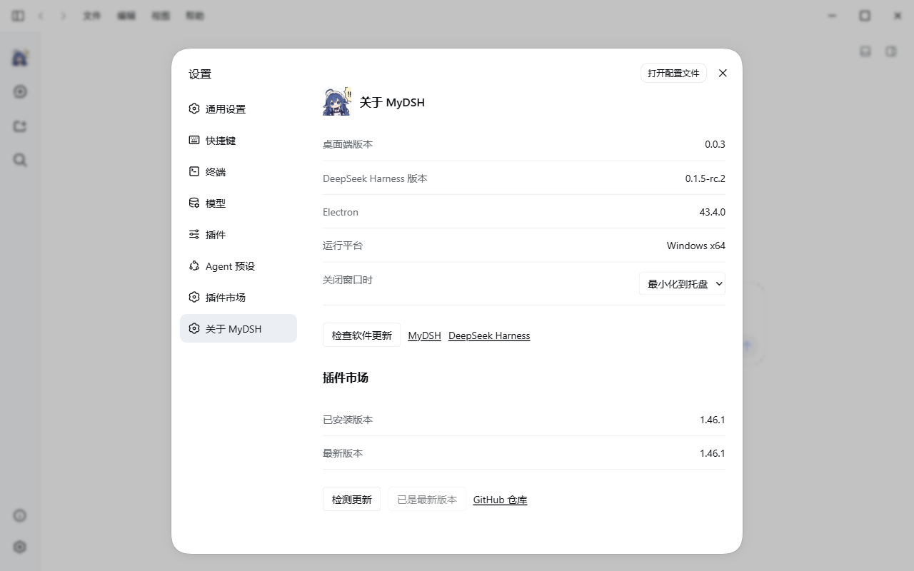

<p align="center">
  
</p>

<h1 align="center">MyDSH</h1>

<p align="center">
  <strong>A native desktop workspace for DeepSeek Harness</strong>
</p>

<p align="center">
  <a href="./README.md">简体中文</a> · English
</p>

<p align="center">
  <a href="./PROJECT_STATUS.zh-CN.md">Project status</a> ·
  <a href="https://github.com/deepseek-ai/deepseek-harness">DeepSeek Harness upstream</a>
</p>

MyDSH brings [DeepSeek Harness](https://github.com/deepseek-ai/deepseek-harness) to the desktop as a focused, local-first workspace for agentic work. Conversations, project files, terminals, web tools, and native desktop actions stay within reach—without fragmenting your workflow across multiple apps.

> [!IMPORTANT]
> MyDSH is under active development. Features, packaging, and the local data schema may change as the project evolves. MyDSH is an independent community project, not an official DeepSeek product.

## Highlights

- **A complete workspace for agentic work** — MyDSH turns DeepSeek Harness into more than a conversation window. Files, terminals, web tools, and plugin discovery live in independent right and bottom workspaces, keeping the tools for understanding, changing, and validating a project beside the active conversation.
- **Local-first by design** — DeepSeek Harness runs locally, while MyDSH keeps its application state and browser session data on your machine. The existing `~/.minke` data directory remains the compatibility location for desktop preferences.
- **A Windows-native desktop experience** — Native menus, configurable shortcuts, Session log export, synchronized themes, and English and Chinese UI are validated for daily Windows x64 use.



## Installation

The current distribution target is Windows x64. Obtain installers from the project's release process and verify the accompanying SHA-256 manifest before installation.

| Platform | Architecture | Package |
| --- | --- | --- |
| Windows | `x64` | `.exe` |

### Windows

1. Download the Windows x64 `.exe` installer from [MyDSH releases](https://github.com/Medo-bao/MyDSH/releases). The current version is **0.0.3**.
2. Run the installer and follow the on-screen instructions.
3. Windows may show a reputation-based warning for a new pre-release build. Verify the source and SHA-256 before continuing.

## Build from source

Running the app requires system Node.js 24+, Corepack/pnpm 11.7.0 and `@deepseek-ai/dsh@0.1.5-rc.2` on PATH. These are not bundled. The tray checks only MyDSH desktop releases, never upstream Harness updates. The market is optional, the upstream main-page name is preserved, and desktop icons use MyDSH artwork.

Build MyDSH on a Windows x64 host. The build produces distributables under `out/nsis`; macOS/Linux and cross-platform packaging are currently unsupported.

Prerequisites:

- Git with submodule support. The `vendor/deepseek-harness` submodule must be checked out.
- Node.js 24 or newer.
- pnpm 11.7.0, with the repository dependencies installed before running the scripts.
- Windows: a Windows x64 host. Visual Studio 2022 Build Tools with the **Desktop development with C++** workload may be needed if a native dependency must be compiled locally.

On a fresh checkout, install repository dependencies and prepare system DSH (the global command changes the current user's DSH installation):

```bash
pnpm install --frozen-lockfile
pnpm add --global @deepseek-ai/dsh@0.1.5-rc.2 --config.node-linker=hoisted --config.enable-global-virtual-store=false
```

The system Node installation must provide Corepack with pnpm 11.7.0, and the global `dsh` shim must be on PATH. `harness:stage` is an isolated build and staging audit tool, not an application startup prerequisite or a replacement for the system installation.

Start MyDSH in development mode with:

```bash
pnpm start
```

`pnpm start` builds the Firefly bundle and launches the development app. System Node, pnpm, and dsh must pass PATH discovery first; run `pnpm run harness:stage` when an isolated runtime needs to be rebuilt.

Create the distributable package for the current platform with:

```bash
pnpm package
pnpm nsis:make
```

Release installers are written to `out/nsis`. `pnpm make` remains available for development Squirrel builds. System Node, pnpm, and dsh are not embedded in the installer.

Based on the [Minke](https://github.com/lencx/Minke) desktop adaptation and DeepSeek Harness. Original licenses and copyright notices are retained.

For troubleshooting, start with [the project status report](./PROJECT_STATUS.zh-CN.md) and local test output, then include the OS version, Harness version, and reproduction steps in an issue.
